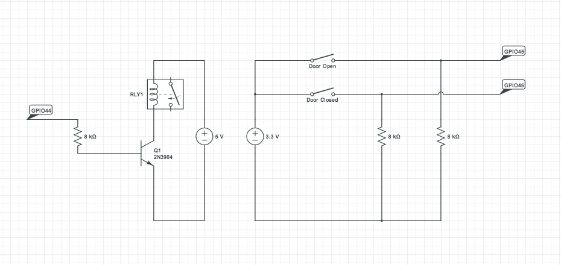
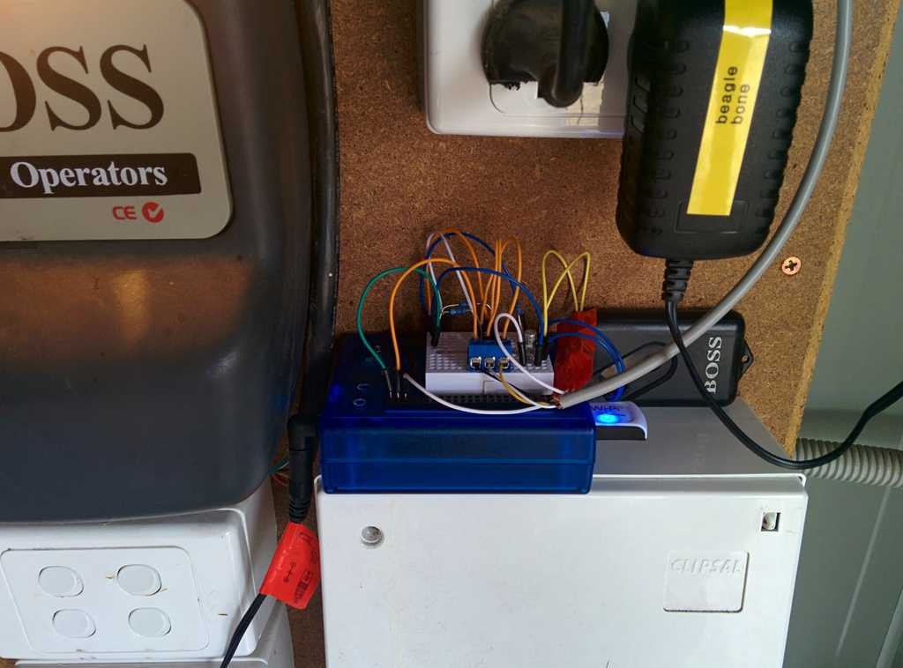

garage
======

Garage door automation.

This is the scripts (for a Beaglebone Black) and simple circuit diagram used to
read and set my garage door state.

On the left is the circuit that turns on and off a repurposed wireless keyfob using a simple repurposed 5v telecoms relay.

On the right are the existing microswitches (_Door Open_, _Door Closed_) hooked into GPIO pins so that the state of the door can be read. This way the keyfob is only ever activated when the door is in a known state as the keyfob only supports a single "toggle" button. If the door is running rough is can stop in the middle of an action or return to a previous state (e.g. if it's in the process of closing but hits a blockage it my stop in the middle or it may return to open). The script `set-garage-door` will not send a keyfob signal if the door isn't in a known good state.

