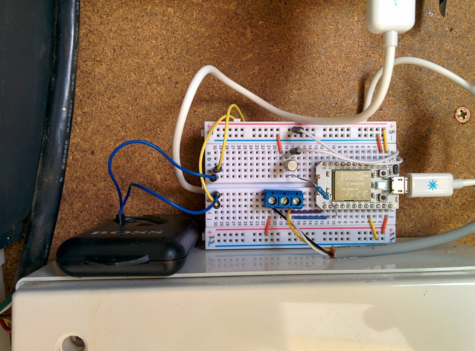

garage
======

Garage door automation.

This is the scripts (for a Beaglebone Black) and simple circuit diagram used to
read and set my garage door state.

On the left is the circuit that turns on and off a repurposed wireless keyfob using a simple repurposed 5v telecoms relay.

On the right are the existing microswitches (_Door Open_, _Door Closed_) hooked into GPIO pins so that the state of the door can be read. This way the keyfob is only ever activated when the door is in a known state as the keyfob only supports a single "toggle" button. If the door is running rough it can stop in the middle of an action or return to a previous state (e.g. if it's in the process of closing but hits a blockage it may stop in the middle or it may return to open). The script `set-garage-door` will not send a keyfob signal if the door isn't in a known good state.

Getting non-root access to the gpio /sys entries
------------------------------------------------

I decided to have a group that can read/write the GPIO entries and then added this group to users who need GPIO access (e.g. www-data for cgi scripts):

	$ sudo groupadd gpio
	$ sudo usermod -a -G gpio www-data

Next update `/etc/rc.local` to enable write access for this group to the `/sys/class/gpio/export` and `/sys/class/gpio/unexport` files by adding the following lines before the `exit 0`:

	chgrp gpio /sys/class/gpio/export /sys/class/gpio/unexport
	chmod g+w /sys/class/gpio/export /sys/class/gpio/unexport

Reconfigure `udev` to call a script after it generates new entries, I put the following into the file `/etc/udev/rules.d/90-gpio.rules`:

	KERNEL=="gpio*", SUBSYSTEM=="gpio", ACTION=="add", PROGRAM="/root/bin/gpio-perms /sys%p"

And finally create the script `/root/bin/gpio-perms` that the `udev` rule above calls to set the group and permissions when entries get created via the `export` file:

	#!/bin/sh
	chgrp -R gpio "$1"
	chmod -R g+rw "$1"
	logger -t gpio-perms updated $1 to group gpio and g+rw

Then reboot and ensure all the perms are as you require (they were for me). Due to timing of scripts running it's very likely the first run of any of the scripts after a reboot will fail as they attempt to access things in `/sys` before `udev` has had a chance to run the script and change the permissions and group. You could code the scripts to gracefully handle this error.

Phase 2: A Spark Core
=====================

I was never very comfortable running such a heavyweight stack (i.e. a full Linux distro) just to control a few digital lines so I'm in the process of switching the BeagleBone for a [Spark Core](http://spark.io). The circuit is identical except for the removal of the pull-down resistors (spark core's have internal pull-down resistors available). The code running on the Spark Core is available in the `garagedoorcontrol.ico` file and so far it's been running perfectly.

